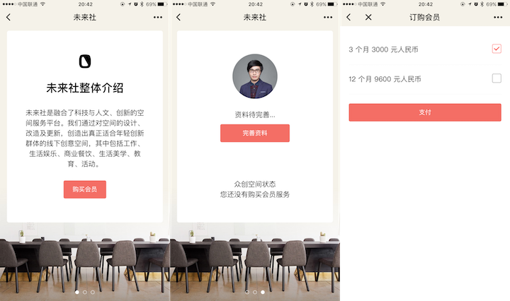
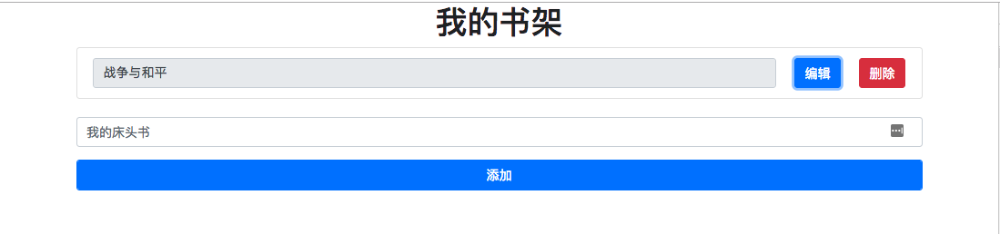
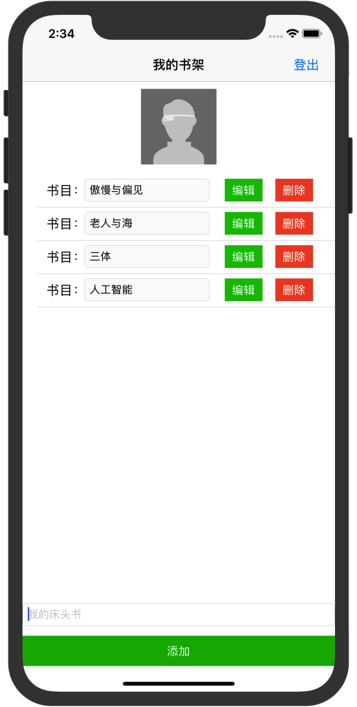

# 知晓云小程序 Demo

我们在这里准备了五个使用[知晓云](https://cloud.minapp.com) BaaS JS SDK 开发的小程序 Demo, 它们分别是：

- [hello-world](hello-world/)：简易的书架小程序，演示了如何在微信小程序中进行基本的用户登录，及知晓云数据表操作
- [lbs-demo](lbs-demo/)：地图黄页 demo，演示了如何在微信小程序中使用地图功能，及进行知晓云数据表复杂查询
- [payment-demo](payment-demo/)：微信支付 demo，演示了如何在微信小程序中获取用户授权和发起微信支付
- [web-sdk-demo](web-sdk-demo/)：简易的书架 H5 网页，演示了如何在网页中进行基本的进行基本的用户登录注册、及知晓云数据表操作
- [alipay-sdk-demo](alipay-sdk-demo/)：简易的书架小程序，演示了如何在支付宝小程序中进行基本的用户登录，及知晓云数据表操作
- [ios-sdk-demo](ios-sdk-demo/)：简易的书架 demo，演示了如何在 app 中进行基本的用户登录，及知晓云数据表操作

## hello-world，书架小程序 Demo

使用知晓云 BaaS JS SDK 实现的书架微信小程序。
通过这个 Demo 你可以学到：

- 基本的微信小程序开发，控件交互等；
- 使用 SDK 对后端数据进行基础的增删改查操作；
- 使用 SDK 进行用户登录及获取用户信息；

[点击这里，查看该 demo 的详细使用文档](hello-world/README.md)

## lbs-demo，地图黄页 demo

通过这个 demo 你可以学到：

- 更加丰富的微信小程序控件使用；
- LBS 业务中微信小程序地图控件的使用；
- 知晓云 BaaS JS SDK 多数据表协作实现复杂逻辑；

[点击这里，查看该 demo 的详细使用文档](lbs-demo/README.md)

## payment-demo，微信小程序支付 demo

通过这个 demo 你可以学到：

- 使用知晓云 BaaS JS SDK 一行代码搞定支付
- 一个简单的电商业务实现

[点击这里，查看该 demo 的详细使用文档](payment-demo/README.md)

## web-sdk-demo，书架 H5 网页 Demo

使用知晓云 BaaS JS SDK 实现的书架 H5 网页。
通过这个 Demo 你可以学到：

- 使用 SDK 对后端数据进行基础的增删改查操作；
- 使用 SDK 进行用户登录及获取用户信息；

[点击这里，查看该 demo 的详细使用文档](web-sdk-demo/README.md)

## alipay-sdk-demo，书架小程序 Demo

使用知晓云 BaaS JS SDK 实现的书架支付宝小程序。
通过这个 Demo 你可以学到：

- 基本的支付宝小程序开发，控件交互等；
- 使用 SDK 对后端数据进行基础的增删改查操作；
- 使用 SDK 进行用户登录及获取用户信息；

[点击这里，查看该 demo 的详细使用文档](alipay-sdk-demo/README.md)

## ios-sdk-demo，书架app Demo

使用知晓云 BaaS iOS SDK 实现的书架微信 demo。
通过这个 Demo 你可以学到：

- 使用 SDK 对后端数据进行基础的增删改查操作；
- 使用 SDK 进行用户注册、登录、登出及获取用户信息；

[点击这里，查看该 demo 的详细使用文档](ios-sdk-demo/README.md)

## android sdk demo，android-bookshelf 我的书架

使用知晓云 BaaS Android SDK 实现的「我的书架」demo app。
通过这个 Demo 你可以学到：

- 使用 SDK 对后端数据进行基础的增删改查操作；
- 使用 SDK 进行用户登录及获取用户信息；

[点击这里，查看该 demo 的详细使用文档](android/bookshelf/README.md)

