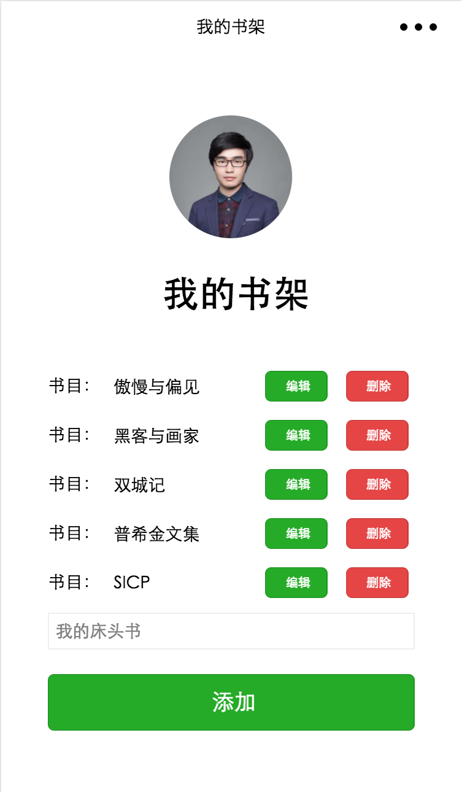

# 知晓云微信小程序 Demo

我们在这里准备了三个使用[知晓云](https://cloud.minapp.com) BaaS JS SDK 开发的微信小程序 Demo。  
它们分别是：

- hello-world：简易的书架 app，演示了基本的用户登录、数据表操作
- lbs-demo：地图黄页 demo，演示了稍微复杂的业务实现
- payment-demo：支付相关的 demo，演示了 SDK 的在线支付的特性支持

## hello-world，书架小程序 Demo

使用知晓云 BaaS JS SDK 实现的书架微信小程序。  
通过这个 Demo 你可以学到：

- 基本的微信小程序开发，控件交互等；
- 使用 SDK 对后端数据进行基础的增删改查操作；
- 使用 SDK 进行用户登录及获取用户信息；

### 使用这个 Demo

*Step 1:*

前往[知晓云](https://cloud.minapp.com) 创建账户，进入控制台完成小程序绑定和数据表的设置。并通过控制台获取到 ClientID、数据表 ID。

*Step 2:*

Clone 代码后，通过微信开发者工具添加项目。将您自己的 ClientID、数据表 ID 替换代码中（app.js）的演示 ID，即可运行代码。

## LBS Demo，地图黄页 app

通过这个 Demo 你可以学到：

- 更加丰富的微信小程序控件使用；
- LBS 业务中微信小程序地图控件的使用；
- 知晓云 BaaS JS SDK 多数据表协作实现复杂逻辑；
