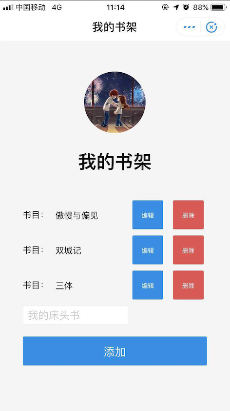

## alipay-sdk-demo，书架小程序 Demo

使用知晓云 BaaS JS SDK 实现的书架支付宝小程序。
通过这个 Demo 你可以学到：

- 基本的支付宝小程序开发，控件交互等；
- 使用 SDK 对后端数据进行基础的增删改查操作；
- 使用 SDK 进行用户登录及获取用户信息；

### 使用这个 demo

*Step 1:*

你也可以手动这么做：
前往[知晓云](https://cloud.minapp.com) 创建账户，进入控制台完成小程序绑定。并通过控制台获取到 ClientID。

*Step 1.1:*
在控制台[数据管理](https://cloud.minapp.com/hydrogen/flex/schema/)创建一个新的数据表 bookshelf，添加一个类型为 String 的数据列：bookName。完成创建之后，在数据表界面的右侧帮助中心获取数据表 Name: tableName。

*Step 2:*

Clone 代码后，通过微信开发者工具添加项目。将您自己的 ClientID, tableName 替换代码中（app.js, index.js）的演示 ID，即可运行代码。
