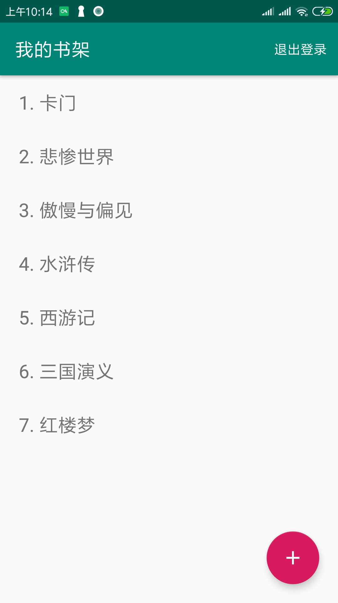

# 我的书架，android demo app

<p align="center"></p>

使用知晓云 BaaS Android SDK 实现的我的书架 app。
通过这个 demo 你可以学到：

- 使用 SDK 对后端数据进行基础的增删改查操作；
- 使用 SDK 进行用户登录及获取用户信息；


### 使用这个 demo

点击<a href="https://cloud.minapp.com/dashboard/?demo=bookshelf-demo" target="_blank">创建示例应用</a>，我们会帮您在知晓云完成应用、数据表、内容库的创建及示例数据的填充。（创建前请先完成登录）

*Step 1:*

你也可以手动这么做：
前往[知晓云](https://cloud.minapp.com) 创建账户，进入控制台完成小程序绑定。并通过控制台获取到 ClientID。

*Step 1.1:*
在控制台[数据管理](https://cloud.minapp.com/dashboard/#/app/schema/)创建一个新的数据表，添加一个类型为 String 的数据列：bookName。完成创建之后，记住你新创建的数据表的表名：TableName。

*Step 2:*

`git clone` 代码至本地（假设你 clone 至 /{repo}/），用 Android Studio 打开 `/{repo}/android/bookshelf`

*Step 3:*

在 `/{repo}/android/bookshelf/app` 下创建 `config.properties`，打开并输入以下内容：

```properties
clientId={这里输入 Step 1 获取到的 ClientID}
```

*Step 3.1:*

假如你是通过 *Step 1.1* 创建的表，则需要打开 `com.minapp.android.example.mybooks.Const`，并将 `TABLE_BOOKS` 替换为你的表名：

```kotlin
object Const {
    const val TABLE_BOOKS = "{TableName}"
}
```

