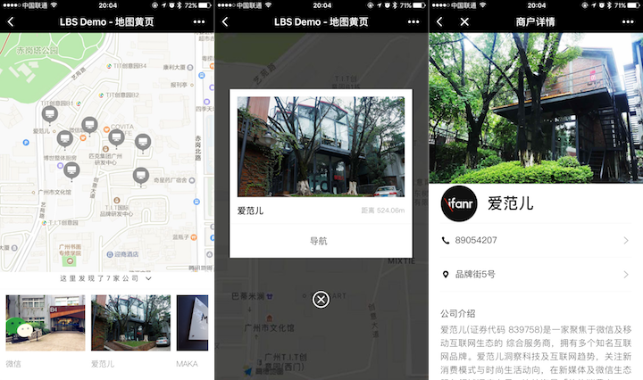

# lbs-demo，地图黄页 demo

通过这个 demo 你可以学到：

- 更加丰富的微信小程序控件使用；
- LBS 业务中微信小程序地图控件的使用；
- 知晓云 BaaS JS SDK 多数据表协作实现复杂逻辑；

### 使用这个 demo

点击<a href="https://cloud.minapp.com/dashboard/?demo=lbs-demo" target="_blank">创建示例应用</a>，我们会帮您在知晓云完成应用、数据表、内容库的创建及示例数据的填充。（创建前请先完成登录）

*Step 1:*

前往[知晓云](https://cloud.minapp.com) 创建账户，进入控制台完成小程序绑定。并通过控制台获取到 ClientID。

*Step 2:*

在控制台[数据管理](https://cloud.minapp.com/hydrogen/flex/schema/)创建一个新的数据表，命名为 company，表的结构如下：

| 字段         | 类型    | 示例 |
| ----------- | ------- | --- |
| title       | string  | 爱范儿 |
| address     | string  | 品牌街5号 |
| description | string  | 爱范儿(证券代码 839758)是一家聚焦于微信及移动互联网生态的 综合服务商，拥有多个知名互联网品牌... |
| logo        | string  | https://media.ifanrusercontent.com/media/tit/atGxbqTGjzYkQOER.jpg |
| image       | array   | ["https://media.ifanrusercontent.com/media/tit/TyjAFWdpYzvklnEn.jpg" , "https://media.ifanrusercontent.com/media/tit/OnKDjKhqzlXDzoFu.jpg"] |
| phone       | string  | 89054207 |
| latitude    | number  | 23.099532 |
| longitude   | number  | 113.323882 |
| category    | array   | ["科技IT"] |
| priority    | integer | 4 |

详细的数据返回实例请参考项目目录下的 ``mock`` 文件夹下的 ``mock.js``。

*Step 3:*

Clone 代码后，通过微信开发者工具添加项目；

将您自己的 ClientID, tableID 填充到代码中需要用到的地方，具体配置到项目目录下的 ``config`` 文件夹下的``config.js``；

lbs-demo 涉及地图接口的调用，本 demo 使用[高德地图的小程序 SDK](https://lbs.amap.com/api/wx/gettingstarted)，需要自行申请高德地图的开发 key，并将其配置项目目录下的 ``config`` 文件夹下的``config.js``。

完成上述操作，即可运行代码。