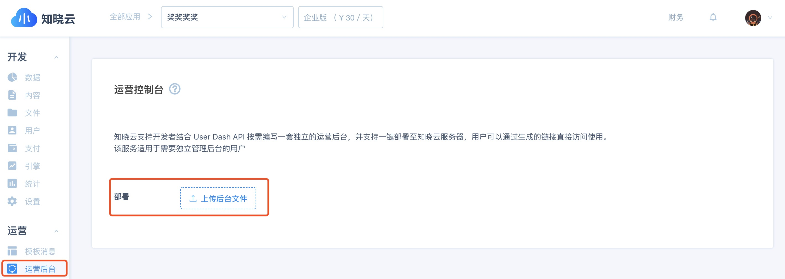
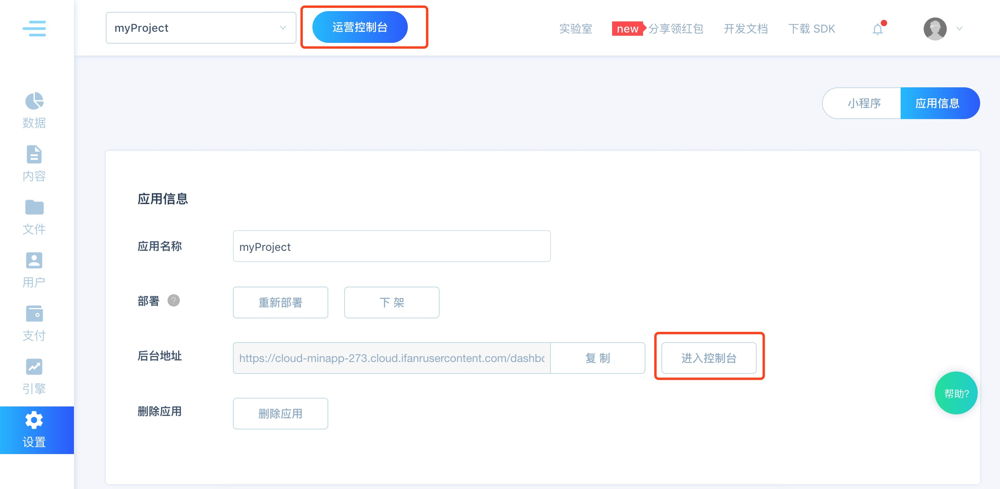
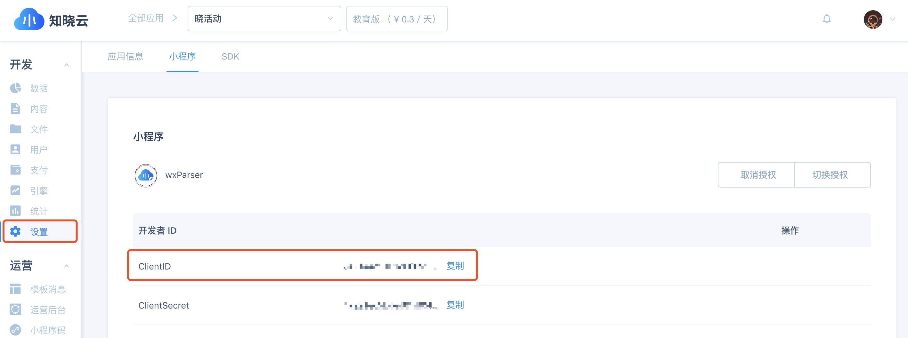
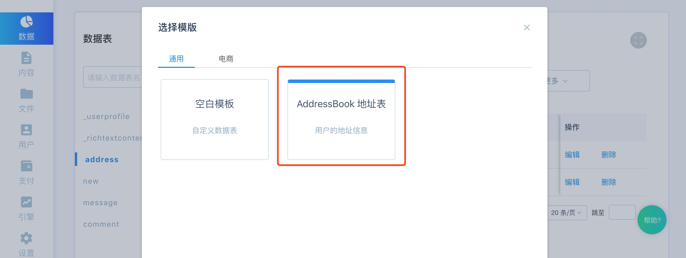

# 一键部署运营后台

知晓云支持开发者结合 User Dash API 按需编写一套独立的运营后台，并支持一键部署至知晓云服务器，用户可以通过生成的链接直接访问使用。

- 该服务适用于需要独立管理后台的用户，比如你的运营同事，并非开发者，你也不会希望他直接操作数据表，此时你可以写一套简单的运营后台供运营同事使用。

## 使用说明

1. 登录知晓云控制台，进入 运营 - 运营控制台，点击一键部署后台


2. 上传打包好 .zip 格式文件，点击确定

3. 上传成功后需要一定的部署时间，部署成功后会有邮件通知

4. 部署成功后会生成一条可访问的链接，你可以直接访问这条链接，或通过点击知晓云顶边栏的【运营控制台】进入部署好的后台


5. 如需更新运营后台，点击重新部署，上传更新后的代码文件即可

   注：后台代码需打包成 .zip 格式，且入口文件必须命名为 index.html，放置在压缩包的一级目录下。

## 运营后台示例

这里提供了一个简单的示例，用于 Demo 演示。使用该文件前你需要做一些准备工作：

1. 在知晓云后台完成授权小程序，获取 ClientID


2. 新建一张数据表，点击使用模板，选择【地址表】，创建成功后记录下 tableID



3. 在下载好的后台文件中将 client_id 替换为已授权应用的 ClientID

   ```ht
   <script src="https://cloud.minapp.com/custom-userdash/auth/:client_id/"></script>
   ```

4. 将示例代码中的 clientId、tableId 替换为已授权应用的 ClientID、创建的地址表 id

   ```js
   var config = {
     clientId: 'xxx', // 应用 ClientID，可在管理后台设置模块找到
     tableId: 'xxx', // 数据表 ID
   }
   ```

### 其他

1. User Dash API 说明文档请查看：[User Dash API](https://doc.minapp.com/user-dash/)
