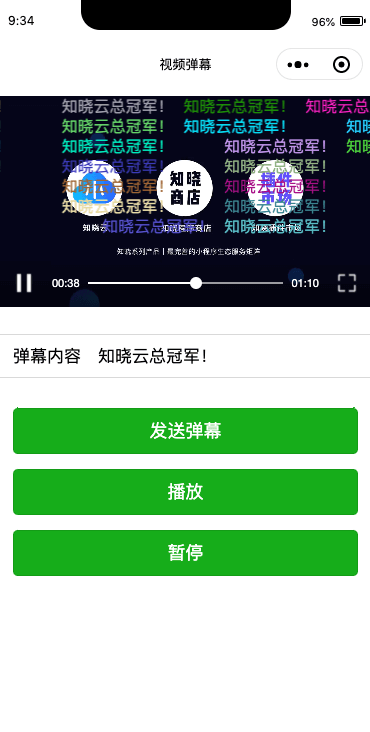

# websocket-demo-danmu，微信小程序 WebSocket 功能 Demo - 视频弹幕

使用知晓云 BaaS JS SDK 实现的视频弹幕微信小程序。
通过这个 demo 你可以学到：

- 基本的微信小程序开发，控件交互等；
- 使用 SDK 对后端数据进行基础的增删改查操作；
- 使用 SDK 进行用户登录；
- 使用 SDK 的实时数据库功能（WebSocket），能够订阅表数据的增删改变化

### 使用这个 demo

*Step 1:*

前往[知晓云](https://cloud.minapp.com) 创建账户，进入控制台完成小程序绑定。并通过控制台获取到 ClientID。

*Step 1.1:*
在控制台[数据管理](https://cloud.minapp.com/hydrogen/flex/schema/)创建一个新的名为 **danmmu_list** 的数据表，添加一个类型为 String 的数据列：text。

*Step 2:*

Clone 代码后，通过微信开发者工具添加项目。将您自己的 ClientID 替换代码中（app.js, index.js）的演示 ID，即可运行代码。
